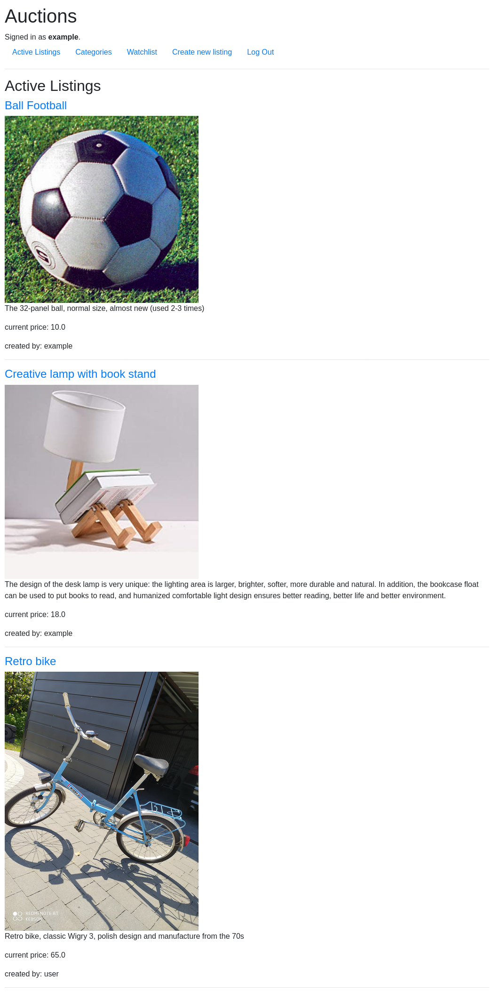
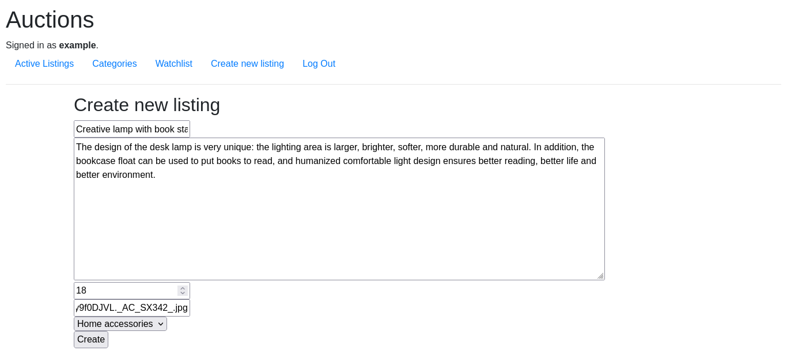
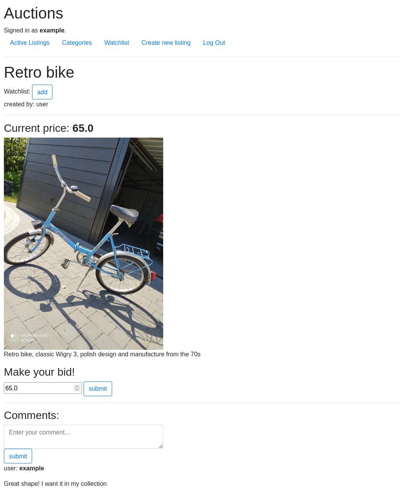

# Commerce
An auction portal web application prepared as a project for [CS50 Web Development online course.](https://cs50.harvard.edu/web/2020/). The project contains several service subpages

## register/login

## rview all active listings

## create new listing

## view listing / make bid

## others
User can also add listings to her/his wishlist, browse wishlist and browse listings filtered by categories